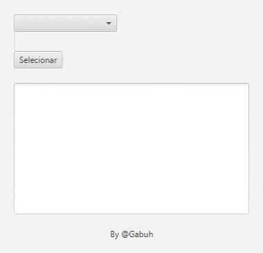
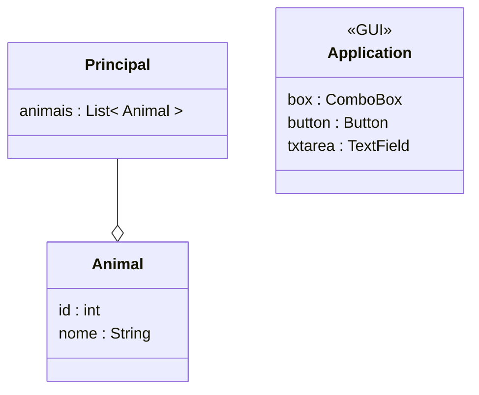

<h1 align='center'> JavaFX </h1>

Crie uma classe "Animal" com os seguintes atributos: id (int), nome
(String) e idade (int). Implemente um construtor e os métodos getters e
setters.

:white_check_mark: No aplicativo JavaFX, crie uma classe principal.

:white_check_mark: Dentro da classe classe principal, crie uma lista de animais e preencha-a com alguns objetos da classe "Animal" com dados fictícios.

:white_check_mark: Crie uma interface gráfica utilizando o JavaFX com os seguintes  elementos:

​	:white_check_mark: Um ComboBox para exibir os nomes dos animais da lista.

​	:white_check_mark: Um botão para exibir os dados completos do animal selecionado.

​	:white_check_mark: Uma TextArea para exibir os dados completos do animal.

:white_check_mark: Preencha o ComboBox com os nomes dos animais da lista.

:white_check_mark: Implemente um evento para o botão que será acionado quando o botão for clicado. Dentro do evento, obtenha o item selecionado do ComboBox e exiba os dados completos do animal na TextArea. Utilize os métodos getters da classe "Animal" para obter os dados.

:white_check_mark: Execute o aplicativo JavaFX e verifique se o ComboBox exibe corretamente os nomes dos animais. Teste também se os dados completos do animal são exibidos corretamente na TextArea ao clicar no botão.

:white_check_mark: (Desafio opcional) Adicione a funcionalidade de limpar a TextArea ao selecionar um novo animal no ComboBox.

:white_check_mark: (Desafio opcional) Adicione a funcionalidade de atualizar a TextArea ao selecionar um novo animal no ComboBox sem precisar do botão.

:white_check_mark: (Desafio opcional) Adicione a funcionalidade de permitir a inclusão de novos animais na lista, onde o nome, idade e ID do animal são informados pelo usuário em campos de texto.